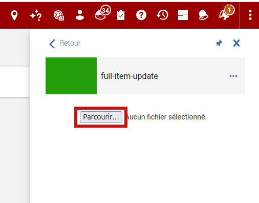
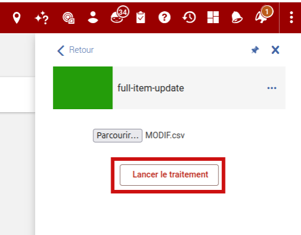
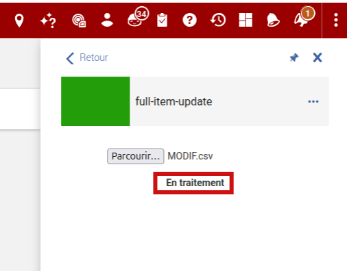
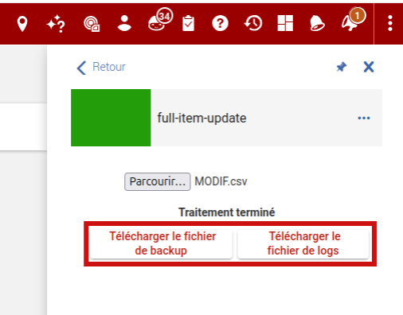

# Functionnal documentation

## General information

Full-item-update allows **an Admin user** to update all the fields of a batch of items listed in a CSV file.

**Warning : if in the CSV, a field is left empty, the old value is deleted**

# How does this cloud-app works

## 1. Insert the csv file

Click on the "Browse..." button to insert the CSV file.

## 2. Start the process

If the file is correct, the "Launch" button appears. Otherwise, an error is displayed bellow the "Browse.." button.

## 3. Loading

When the process has started, "Loading" appears on the screen. If a blocking error is raised, the process stops and the error message will be displayed on the screen.

## 4. The process has ended

When the process ends, two buttons are displayed on the screen.

- "Download backup file" to download the CSV file (.xlsx format) containing the backup data.
- "Download logs file" to download the error logs file (.txt format).

