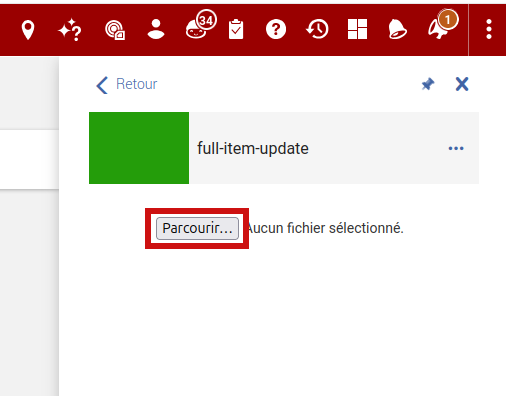
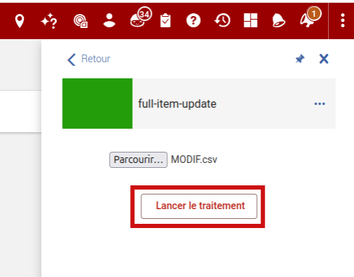
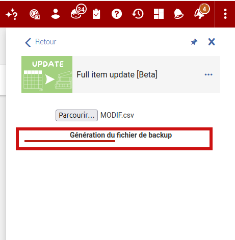
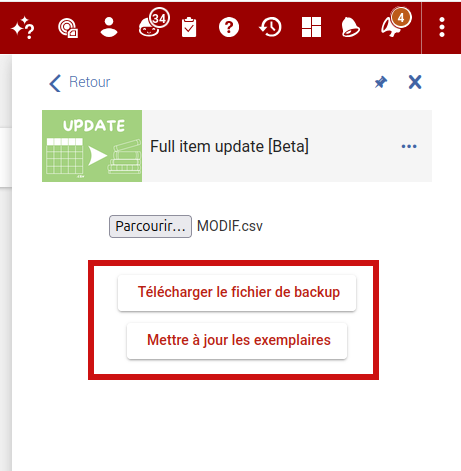
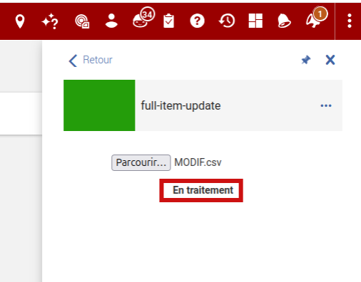
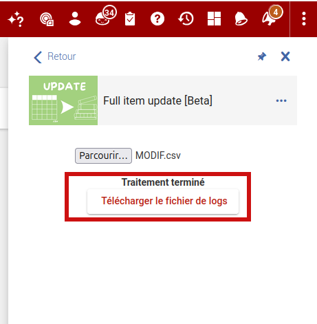

# Functionnal documentation

## General information

Full-item-update allows **an Admin user** to update all the fields of a batch of items listed in a CSV file.

**Warning : if in the CSV, a field is left empty, the old value is deleted**

**The CSV file can contain up to 5,000 lines without the header.**

A malfunction has been observed when using Firefox on Windows while inserting a file. It seems to be the same with other cloud-apps.

# How does this cloud-app works

## 1. Insert the CSV file

Click on the "Browse..." button to insert the CSV file.

## 2. Start the process

If the file is correct, the "Launch" button appears. Otherwise, an error is displayed below the "Browse..." button.

## 3. Generating the backup file

When the process of the first phase has started, "Generating the backup file..." appears below the "Browse..." button. If a blocking error is raised, the process stops and the error message will be displayed on the screen.

## 4. File generated

When the first phase ends, two buttons appear on the screen.

- "Download backup file" to download the CSV file (.xlsx format) containing the backup data.
- "Update the items" to launch the second phase and update the items.

## 5. Updating the items

When updating the items, the "Loading" text appears on the screen. Please do not close the tab during the process.

## 6. End of the process

When the process has ended, a button "Download logs file" to download the error logs file (.txt format) appears.

